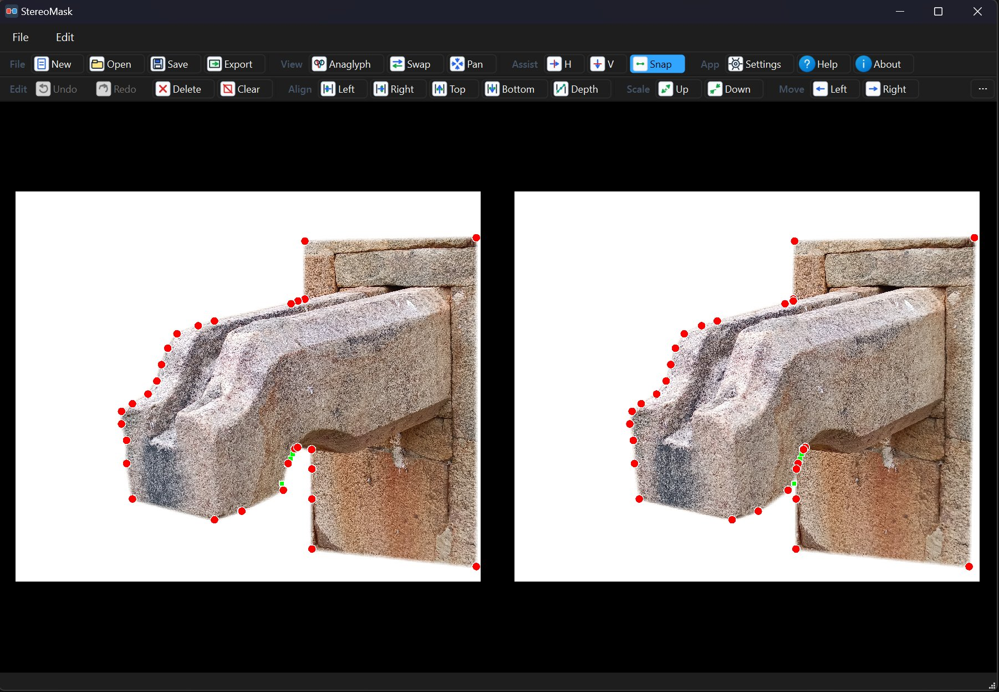

# StereoMask v2.0.0

A precision masking tool for side-by-side (SBS) stereo images, developed with **GEMINI CLI** and Qt6.



## New in v2.0.0

- **OpenCV AutoMask:** Native MinGW/OpenCV stereo matching creates editable mask points from SBS image overlap.
- **Depth-Aware Auto Points:** Auto-generated points carry per-point disparity so the right-eye mask follows depth offsets.
- **Freehand Mask Drawing:** Draw masks directly with a simplified editable polygon output.
- **Freehand Cleanup:** Freehand strokes are smoothed, simplified, and capped to a practical point count.
- **Undoable Mask Creation:** AutoMask and Freehand mask creation integrate with the existing undo stack.
- **Bundled OpenCV Runtime:** Release builds copy required vcpkg/OpenCV DLLs beside the application.

## New in v1.3.0

- **Grouped Two-Row Toolbar:** Cleaner File/View and Edit/Mask toolbars with grouped controls.
- **Custom Scalable Icons:** Replaced emoji and legacy 16px icons with a consistent in-app vector icon set.
- **Curve-Aware Rotation:** Curve and Rx/Ry/Rz controls are grouped together; rotation is enabled only for curved selections.
- **Async Export:** Export runs off the UI thread and reports success/failure accurately.
- **Safer Image Handling:** Added SBS dimension validation and bounded image allocation.

## New in v1.2

- **Refined Mask Feathering:** Soften mask edges with pixel-perfect precision (0-200px) without affecting image borders.
- **Snapping Toggle:** Quickly toggle point snapping on/off via the toolbar or shortcut (**`S`**).
- **Export Progress Tracking:** Real-time feedback in the status bar during image export.
- **Smart Folder Persistence:** Automatically remembers the last used directory for all file operations.
- **Optimized Rendering:** Improved masking engine with better memory safety and performance capping.

## Core Features

- **Grouped Toolbar:** Intuitive controls for file operations, editing, masking, and transforms.
- **Precision Masking:** Add, move, and multi-select points to define custom masks for 3D images.
- **OpenCV AutoMask:** Generate editable mask polygons from stereo disparity using native C++ OpenCV.
- **Freehand Masking:** Draw an initial mask shape by hand, then refine the generated control points.
- **Masked Anaglyph Preview:** Real-time 3D preview of your mask using Red/Cyan channels, supporting both parallel and cross-eye sources.
- **Project Persistence (.msk):** Save your work as mask projects that store point data and project-specific settings.
- **Interleaving Space:** Configure gaps between eye images in exported masks, filled with customizable background colors.
- **AutoSave:** Optional automatic saving of project changes.
- **Recent Files:** Quick access to the last 5 worked-on projects.
- **High-DPI Support:** Fully optimized for 4K and multi-monitor setups.

## Author

**S. Rathinagiri**

## License

This project is licensed under the [MIT License](LICENSE).

## Requirements

- Qt 6.x
- CMake 3.16+
- C++17 Compatible Compiler
- OpenCV 4 built for MinGW via vcpkg (`opencv4:x64-mingw-dynamic`)

## Building

```powershell
$env:PATH = "D:\Qt\6.11.0\mingw_64\bin;D:\Qt\Tools\mingw1310_64\bin;" + $env:PATH
cmake -B build -S . -G "MinGW Makefiles" -DCMAKE_BUILD_TYPE=Release
cmake --build build
```

The project expects the vcpkg OpenCV install at `D:\vcpkg\installed\x64-mingw-dynamic`.
The build copies the required OpenCV runtime DLLs into `build\` beside `StereoMask.exe`.
